# Employee Management System

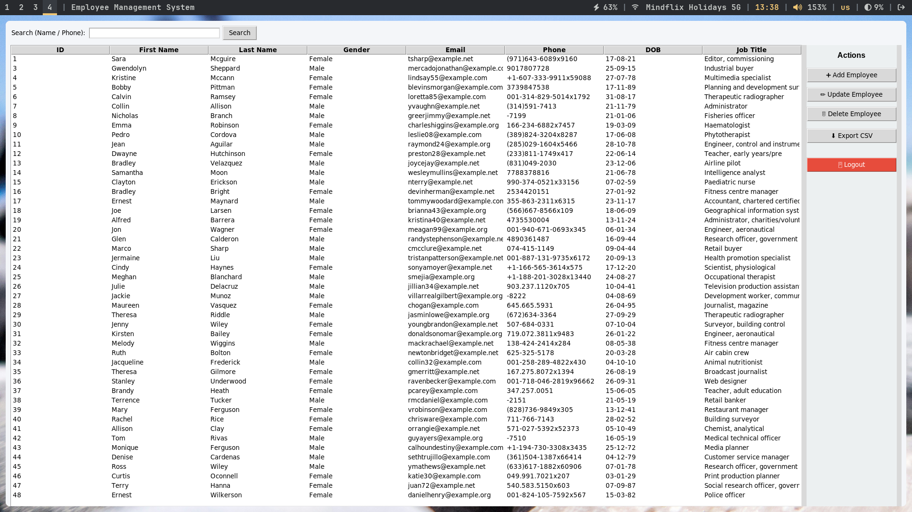

## Description

A GUI-based Employee Management System using Python, Tkinter, and MongoDB.

## Features

- User Login
- CRUD Operations
- Search
- Input Validation
- CSV Export
- MongoDB Integration

## Technologies

- Python
- Tkinter
- MongoDB
- PyMongo

## Sample Data for reference

There is sample data present in the `data/` folder.  
(Source: [Kaggle](https://www.kaggle.com))

## How to Run

### Prerequisite

- Python version 3.11 or greater
- Mongodb database

1. Create .env file and put your mongodb url in the following format.

```
MONGODB_URI=<Your_mongodb_url>
```

2. Install requirements: pip install pymongo

```
pip install -r requirements.txt
```

3. Run: python main.py

```
python main.py
```

## Scenario

Company employee record management system.

## Showcase

### Authentication

- **Login Screen**  
  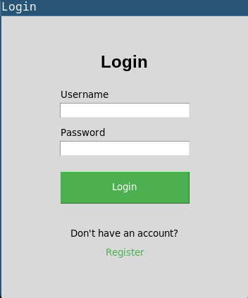
- **Login Required Field Error**  
  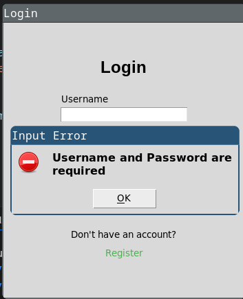
- **Incorrect Password**  
  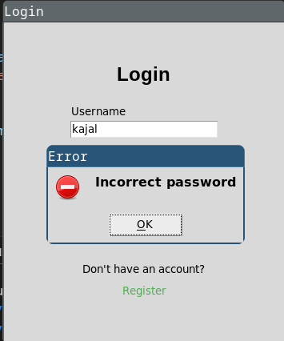
- **Register Screen**  
  
- **Register Name Error**  
  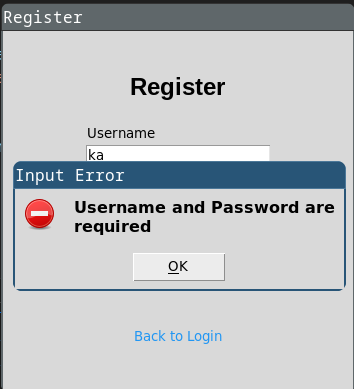
- **Username Already Exists Error**  
  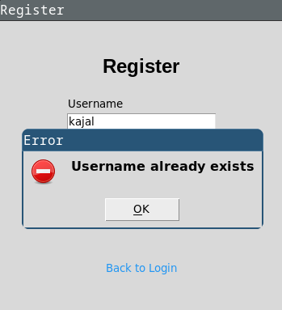
- **Register Success**  
  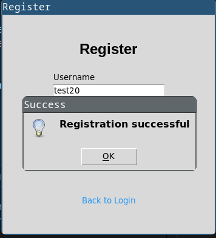

### Employee Management

- **Full Screen Employee Table**  
  
- **Add Employee**  
  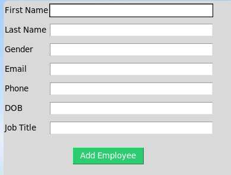
- **Add Employee Success**  
  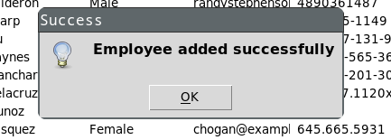
- **Update Employee Selection Warning**  
  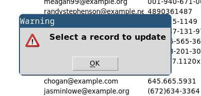
- **Update Employee Form**  
  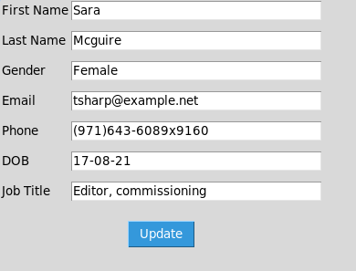
- **Update Success**  
  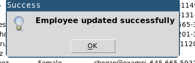
- **Delete Employee Warning**  
  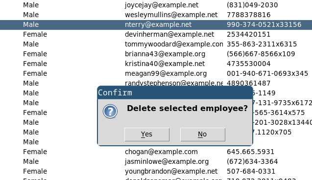
- **Delete Employee Success**  
  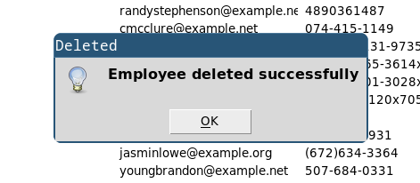
- **Search Employee**  
  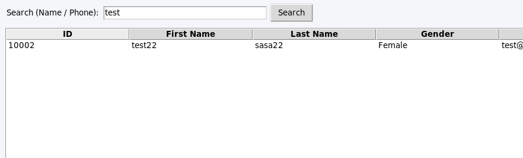
- **Export CSV**  
  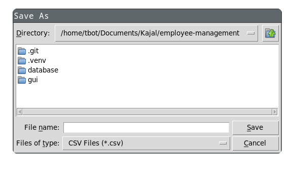
- **Logout**  
  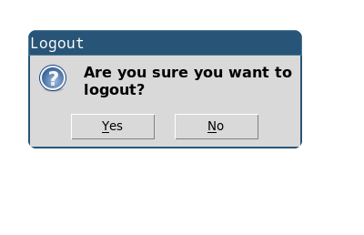
